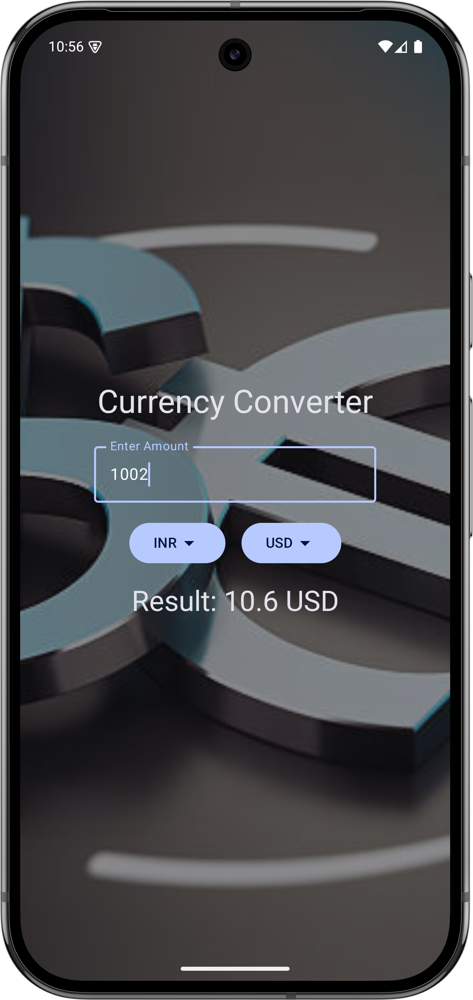
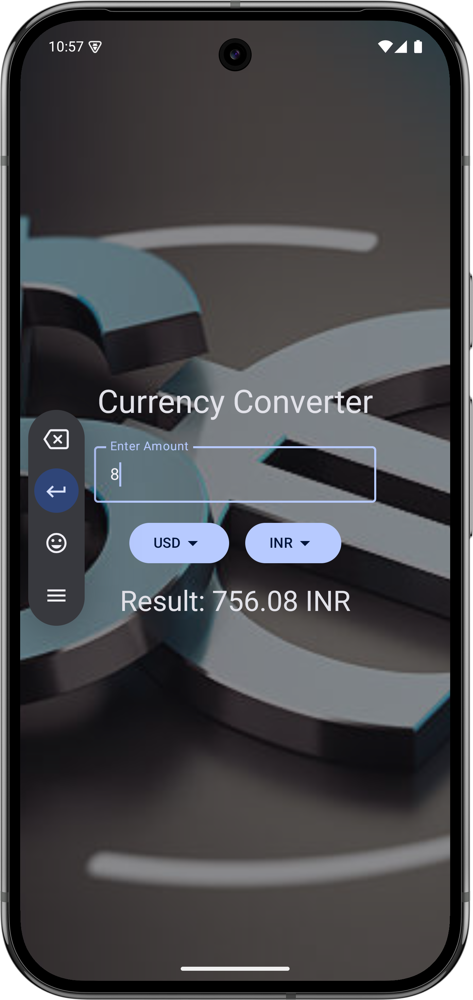

# Logic Lab 🧪

Welcome to **Logic Lab**, a curated collection of utility-driven Android applications built using **Jetpack Compose**. This repository serves as a playground for exploring modern Android development patterns, focusing on clean UI, efficient state management, and seamless user experiences.

---

## 🌟 Featured Applications

### 1. Currency Converter 💵
The **Currency Converter** is a sleek, reactive application designed for quick financial calculations. Whether you're traveling or trading, this tool provides instant conversions with a focus on simplicity.

*   **Key Features:**
    *   ✨ **Reactive UI:** Calculations update instantly as you type.
    *   🌍 **Multi-Currency Support:** Convert between INR, USD, EUR, CNY, and RUB.
    *   🎨 **Aesthetic Design:** Features a custom background and Material 3 components for a premium feel.
    *   📱 **Edge-to-Edge:** Fully supports modern Android display standards.

#### 📸 Screenshots
<p align="center">
  
  
</p>

---

### 2. Unit Converter 📏
The **Unit Converter** is a handy tool for everyday measurements. It simplifies the process of switching between different units of length with an intuitive interface.

*   **Key Features:**
    *   🔄 **Dual-Way Conversion:** Easily switch between Centimeters, Meters, Millimeters, and Feet.
    *   🔽 **Smart Dropdowns:** Interactive selection menus for seamless unit switching.
    *   🎯 **Precision:** Accurate rounding to ensure reliable results.
    *   🌈 **Material You:** Leverages Material 3 design principles for a modern look.

#### 📸 Screenshot
<p align="center">
  
</p>

---

### 3. Business Card 📇
The **Business Card** app is a digital representation of a professional profile. It showcases how to use Compose to create beautiful, static layouts that are both functional and visually appealing.

*   **Key Features:**
    *   👤 **Profile Branding:** Clean presentation of name and professional title.
    *   📞 **Contact Integration:** Easy-to-read layout for phone, social media, and email.
    *   🖼️ **Vector Graphics:** Utilizes high-quality vector icons for a sharp look on any screen density.
    *   🎨 **Themed UI:** Uses a professional color palette to leave a lasting impression.

---

## 🚀 Tech Stack & Tools

*   **Language:** [Kotlin](https://kotlinlang.org/) - Modern, concise, and safe.
*   **UI Framework:** [Jetpack Compose](https://developer.android.com/jetpack/compose) - Android’s modern toolkit for native UI.
*   **Design System:** [Material Design 3](https://m3.material.io/) - The latest evolution of Material Design.
*   **Build Tool:** [Gradle (Kotlin DSL)](https://gradle.org/) - Flexible and powerful build automation.
*   **Architecture:** State-driven UI with `remember` and `mutableStateOf`.

---

## 🛠️ Getting Started

To get a local copy up and running, follow these simple steps:

1.  **Clone the Repo:**
    ```bash
    git clone https://github.com/rathee-dev/Logic-Lab.git
    ```
2.  **Open in Android Studio:**
    Open the root directory or any sub-project (e.g., `UnitConverter`) in Android Studio (Ladybug or newer recommended).
3.  **Sync Gradle:**
    Allow the project to sync and download necessary dependencies.
4.  **Run:**
    Connect your Android device or start an emulator and hit the **Run** button!

---

## 🤝 Contributing

Contributions are what make the open-source community such an amazing place to learn, inspire, and create. Any contributions you make are **greatly appreciated**.

1. Fork the Project
2. Create your Feature Branch (`git checkout -b feature/AmazingFeature`)
3. Commit your Changes (`git commit -m 'Add some AmazingFeature'`)
4. Push to the Branch (`git push origin feature/AmazingFeature`)
5. Open a Pull Request

---

## 👨‍💻 Author

**Himanshu**
- GitHub: [@rathee-dev](https://github.com/rathee-dev)
- Role: Android Developer Extraordinaire 🚀

---

## 📜 License

Distributed under the MIT License. See `LICENSE` for more information.

---
<p align="center">
  <i>Developed with ❤️ by <a href="https://github.com/rathee-dev">rathee-dev</a></i>
</p>
